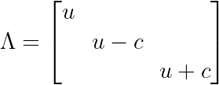
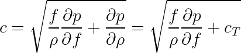
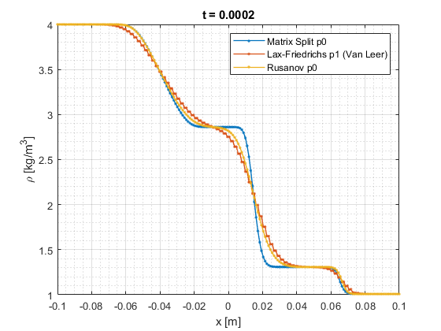

# turcottemodel
Finite volume solution for isothermal Euler of a mixed magma-vapour mixture model.

Based on [Turcotte et al. 1990](https://doi.org/10.1111/j.1365-246X.1990.tb01763.x), this learning code models mixture mass and momentum conservation laws, and conservation of the melt phase. The primitive variables are mixture density, momentum density using the mixture density, and volume fraction of melt (with dissolved gas). The energy equation is not needed in the isothermal setting.

The hyperbolic system of three PDEs has eigenvalues

where

is the relevant wave speed (different from the isothermal sound speed c_T due to the other term under the square-root).

Three basic finite volume methods are implemented in the code: (1) a piecewise constant reconstruction with flux computed in quasilinear form, upwinded using a matrix split of the flux Jacobian; (2) a piecewise linear reconstruction with Lax-Friedrichs flux; and (3) a piecewise constant reconstruction with Local Lax-Friedrichs (Rusanov) flux.

**Figure**: Shock tube problem using solubility law for water in basalt from Wilson & Head (ref. in Turcotte et al. 1990). Initial conditions have volume fraction equal to 1 - ε on the left (nearly-saturated magma) and zero on the right (flux Jacobian is undefined at f = 1). Rarefaction wave propagates to the left. Contact discontinuity (interface between foamy magma-vapour mixture and the gas phase) and gas shock propagate to the right. The latter two discontinuous waves are smeared out by the numerical scheme. Artificial values of T = 300 K, gas constant for air, dry magma density 2 kg/m^3, and mass concentration of 1.0 are used to get a baseline case for the numerics. See commit 9e2aab1.

## Usage
▶️ The main file is **shocktube.m**. The code uses simple parallelization to make my slow code faster. If this is not desired, replace *parfor* with *for* everywhere.
